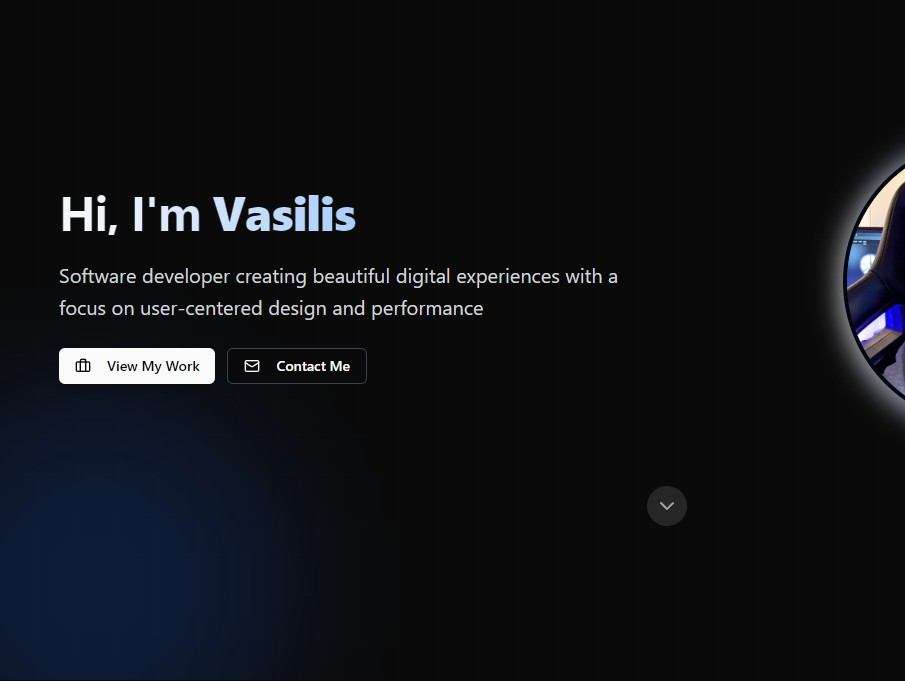

# Vasilis Rousis | Portfolio Website



A modern, high-performance portfolio website built with Nuxt 3, Tailwind CSS, and reka-ui (shadcn Vue components). This website showcases my projects, skills, and experience with a focus on accessibility, performance, and responsive design.

## 🌟 Features

- 🚀 **Perfect Lighthouse score**: 100 in Performance, Accessibility, Best Practices, and SEO
- 🌓 **Dark mode support** with system preference detection
- 📱 **Fully responsive design** that looks great on all devices
- ⚡ **Optimized performance** with image optimization, code splitting, and lazy loading
- 🔍 **SEO-friendly** with proper meta tags and structured data
- 🧩 **Modular component architecture** for easy maintenance and expansion
- 📬 **Contact form** with validation, reCAPTCHA protection, and rate limiting
- 🎨 **Modern UI components** built with reka-ui

## 🛠️ Tech Stack

- **Framework**: [Nuxt 3](https://nuxt.com/)
- **Styling**: [Tailwind CSS](https://tailwindcss.com/)
- **UI Components**: [reka-ui](https://reka-ui.dev/) (Vue implementation of shadcn/ui)
- **Image Optimization**: [@nuxt/image](https://image.nuxt.com/)
- **Icons**: [Lucide Icons](https://lucide.dev/)
- **Form Processing**: Node.js with Nodemailer
- **Security**: reCAPTCHA integration, rate limiting
- **Analytics**: Vercel Analytics
- **TypeScript**: For type safety and better development experience

## 📋 Pages

- 🏠 **Home**: Introduction, featured projects, skills, and certifications
- 👤 **About**: Personal story, experience, and skills
- 🖥️ **Projects**: Gallery of projects with filtering options
- 📞 **Contact**: Contact form with validation and anti-spam measures

## 🚀 Getting Started

### Prerequisites

- Node.js (v16+)
- npm, yarn, or pnpm

### Installation

1. Clone this repository:
   ```bash
   git clone https://github.com/Vasilis-Rousis/portfolio-website.git
   cd portfolio-website
   ```

2. Install dependencies:
   ```bash
   npm install
   # or
   yarn install
   # or
   pnpm install
   ```

3. Set up environment variables:
   Create a `.env` file in the root directory with the following variables:
   ```
   EMAIL_HOST=smtp.example.com
   EMAIL_PORT=587
   EMAIL_USER=your-email@example.com
   EMAIL_PASS=your-email-password
   EMAIL_SECURE=false
   EMAIL_RECIPIENT=your-email@example.com
   RECAPTCHA_SITE_KEY=your-recaptcha-site-key
   RECAPTCHA_SECRET_KEY=your-recaptcha-secret-key
   ```

4. Start the development server:
   ```bash
   npm run dev
   # or
   yarn dev
   # or
   pnpm dev
   ```

5. Open your browser and navigate to `http://localhost:3000`

## 🏗️ Building for Production

To build the application for production:

```bash
npm run build
# or
yarn build
# or
pnpm build
```

Preview the production build:

```bash
npm run preview
# or
yarn preview
# or
pnpm preview
```

## 🔧 Customization

### Modifying Content

- Update the personal information and projects in the respective Vue files:
  - Home page: `pages/index.vue`
  - About page: `pages/about.vue`
  - Projects page: `pages/projects.vue`
  - Contact page: `pages/contact.vue`

### Styling

- Global CSS: `assets/css/global.css`
- Tailwind configuration: `tailwind.config.js`
- Theme colors: `assets/css/tailwind.css`

### Adding Projects

Add new projects to the `projects` array in `pages/projects.vue`:

```javascript
const projects = [
  {
    id: 4, // Increment ID
    title: "New Project",
    description: "Brief description of the project",
    image: "/images/new-project.jpg",
    tags: ["Tag1", "Tag2", "Tag3"],
    link: "https://github.com/yourusername/project",
    longDescription: "Detailed description...",
    category: "web" // or "mobile" or other category
  },
  // existing projects...
];
```

## 📱 Performance Optimizations


- Image optimization with `@nuxt/image`
- Lazy loading components and images
- Code splitting
- CSS optimization with Tailwind
- Server-side rendering for faster initial load
- Preload critical assets
- Responsive image sizes

## 🔒 Security Features

- reCAPTCHA v3 integration
- Rate limiting for form submissions
- Input validation and sanitization
- CORS protection
- XSS prevention

## 📄 License

This project is licensed under the MIT License - see the [LICENSE](LICENSE) file for details.

## 📬 Contact

Vasilis Rousis - [vasileios.rousis1@gmail.com](mailto:vasileios.rousis1@gmail.com)

Project Link: [https://github.com/Vasilis-Rousis/portfolio-website](https://github.com/Vasilis-Rousis/portfolio-website)

---

⭐ Star this repo if you find it useful! ⭐
